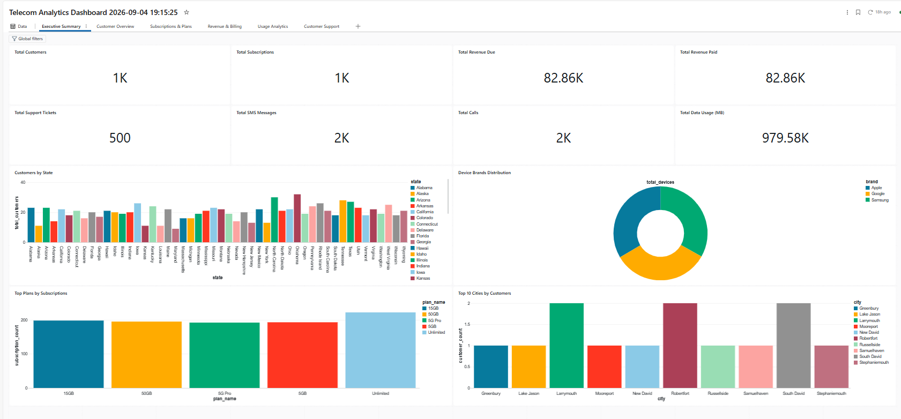
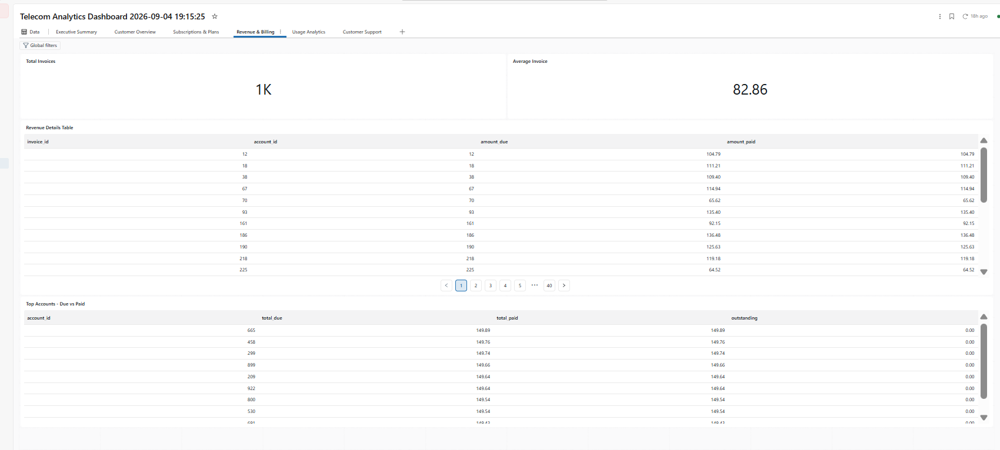
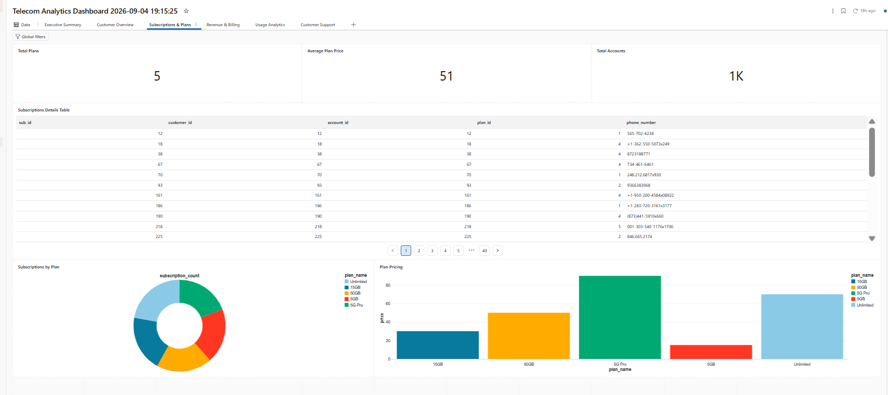
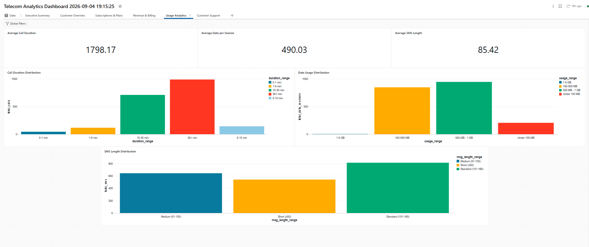
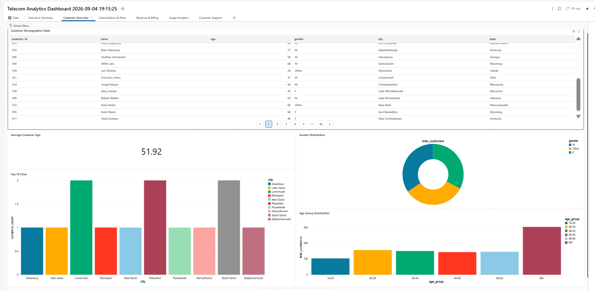
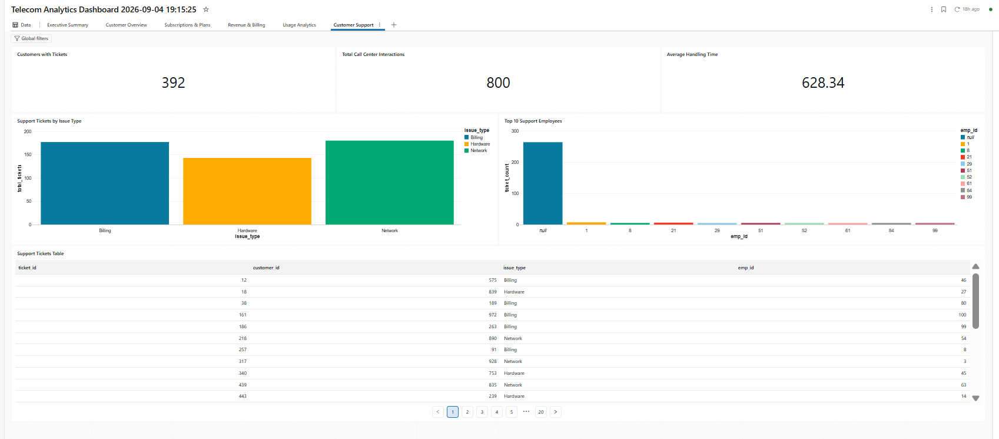

# Telecom Data Analytics Pipeline (Medallion Architecture)

An end-to-end data engineering and analytics pipeline built in Databricks. This project ingests over 25 raw telecom datasets, processes them through a Medallion Architecture (Bronze, Silver, Gold), and surfaces the final analytical models into a suite of Databricks Dashboards using Databricks Genie.

##  Architecture & Data Flow

* **Bronze Layer (`telecom.default`):** Raw CSV data (demographics, billing, network infrastructure, support logs) ingested natively into Delta tables.
* **Silver Layer (`telecom.silver`):** Cleansed and standardized data. Applied schema enforcement, deduplication, timezone standardization, and data type casting.
* **Gold Layer (`telecom.gold`):** Final Star/Constellation schema. The data is modeled into business-ready Facts (e.g., `fact_revenue`, `fact_call_usage`, `fact_support_tickets`) and Dimensions (e.g., `dim_customer`, `dim_plan`, `dim_device`).

##  Tech Stack
* **Compute:** Databricks Free Edition
* **Language:** PySpark / SQL
* **BI / Visualization:** Databricks Dashboards 

##  Dashboards

The final Gold tables power six distinct analytical dashboards. 

### Executive Summary
High-level KPIs tracking total revenue, active subscriptions, and customer acquisition. 

### Revenue & Billing
Financial tracking comparing amounts billed versus amounts paid, alongside Average Revenue Per User (ARPU) trends.

### Subscriptions & Plans
Breakdowns of prepaid vs. postpaid accounts and overall plan popularity.

### Usage Analytics
Network consumption metrics detailing call durations by type and daily data usage trends.

### Customer Overview
Demographic breakdowns and customer acquisition metrics across physical store locations.

### Customer Support
Support ticket volumes categorized by resolution status and tracking week-over-week ticket generation.

Team Members

Sugumaran S

Sriranganathan S

Yogesh C

Srinivasa Rajan M
